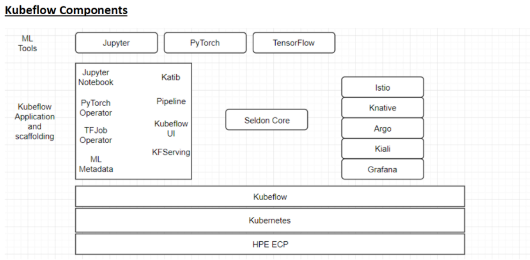
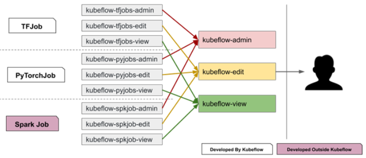

### Kubeflow
Kubeflow is the machine learning (ML) toolkit for Kubernetes. It makes deployments of ML workflows on Kubernetes simple, portable and scalable.
Kubeflow includes:

 - Services for spawning and managing Jupyter notebooks. Use notebooks for interactive data science and experimenting with ML workflows.

 - Kubeflow Pipelines is a platform for building, deploying, and managing multi-step ML workflows based on Docker containers.

 - Kubeflow offers several components that you can use to build your ML training, hyperparameter tuning, and serving workloads.

### Conceptual overview

Kubeflow builds on Kubernetes as a system for deploying, scaling, and managing complex systems. The following diagram shows Kubeflow as a platform for arranging the components of your ML system on top of Kubernetes:



### Kubeflow resources

Kubeflow is created and managed by Kubeflow Operator in ECP k8s Cluster.

Kubeflow Operator is based on the [open-source operator](https://github.com/kubeflow/kfctl/blob/master/operator.md) that is slightly modified. 
More information about the open-source Operator can be found [here](https://docs.google.com/document/d/1vNBZOM-gDMpwTbhx0EDU6lDpyUjc7vhT3bdOWWCRjdk/edit).

The Kubeflow Operator is built on top of KfDef Custom Resource (CR). 

```
$ kubectl get kfdef -n kubeflow

NAME       AGE
kubeflow   4h36m
```

KfDef is a set of Kubernetes applications (resources) created by kustomize configurations. For example, Istio CRD:

```
$ kubectl get kfdef -n kubeflow

...
    Name:      istio-crds
    Kustomize Config:
      Overlays:
        grafana
        kiali
      Parameters:
        Name:   namespace
        Value:  istio-system
        Name:   airgapRegistry
      Repo Ref:
        Name:  manifests
        Path:  istio-1-3-1/istio-install-1-3-1
...
```

Kubeflow operator pod sits in kubeflow-operator namespace.

```
$ kubectl get pods -n kubeflow-operator

NAME                                      READY   STATUS      RESTARTS   AGE
dex-cm-generator-hlxdf                    0/1     Completed   0          4h43m
hpecpconfig-patch-gfxhh                   0/1     Completed   0          4h43m
kubeflow-operator-68bdd75b8b-q5v8j        1/1     Running     1          4h43m
local-path-provisioner-5fd8f5bbb8-5ksm6   1/1     Running     1          4h43m
```

Below are the pods created by Kubeflow operator in Kubeflow namespace.

```
$ kubectl get pods -n kubeflow

NAME                                                        READY   STATUS    RESTARTS   AGE
admission-webhook-deployment-69c9b46895-rb678               1/1     Running   1          4h40m
application-controller-stateful-set-0                       1/1     Running   1          4h42m
argo-ui-65df8c7c84-dkjmp                                    1/1     Running   1          4h40m
centraldashboard-5864774c5-ghrwq                            1/1     Running   1          4h40m
jupyter-web-app-deployment-7bd87b558b-zkjcs                 1/1     Running   1          4h40m
katib-controller-7fcc95676b-4kznm                           1/1     Running   2          4h40m
katib-db-manager-85db457c64-glxqh                           1/1     Running   2          4h40m
katib-mysql-6c7f7fb869-5bvr8                                1/1     Running   1          4h40m
katib-ui-65dc4cf6f5-tvmtv                                   1/1     Running   2          4h40m
kfserving-controller-manager-0                              2/2     Running   2          4h40m
metadata-db-7bfd9f7d4b-db2bn                                1/1     Running   1          4h40m
metadata-envoy-deployment-56647cf45-hjl7f                   1/1     Running   1          4h40m
metadata-grpc-deployment-5989ffcc5-dhw6t                    1/1     Running   5          4h40m
minio-5ff57fbbb-m9c9s                                       1/1     Running   1          4h40m
ml-pipeline-688c9d4947-mr2pb                                1/1     Running   2          4h40m
ml-pipeline-persistenceagent-5c5c8b5686-rwxqr               1/1     Running   5          4h40m
ml-pipeline-scheduledworkflow-55c7dd5c86-g2m9s              1/1     Running   1          4h40m
ml-pipeline-ui-66d4b66785-hh45n                             1/1     Running   1          4h40m
ml-pipeline-viewer-controller-deployment-6f588776c8-nb2qs   1/1     Running   1          4h40m
ml-pipeline-visualizationserver-699c5fd945-4gxf6            1/1     Running   1          4h40m
mysql-7fcd5d4b9c-bqsg4                                      1/1     Running   1          4h40m
notebook-controller-deployment-75bdc8c9b8-6pcf7             1/1     Running   1          4h40m
profiles-deployment-84cd44986c-jb8kb                        2/2     Running   2          4h40m
pytorch-operator-6fcf6866cf-nrdvn                           1/1     Running   4          4h40m
seldon-controller-manager-6bf8b45656-8r6hz                  1/1     Running   2          4h40m
spartakus-volunteer-558f8bfd47-wsfg9                        1/1     Running   1          4h40m
tf-job-operator-58477797f8-hnch2                            1/1     Running   4          4h40m
workflow-controller-64fd7cffc5-sfdtx                        1/1     Running   1          4h40m
zeppelin-operator-864474fdd-r9nzt                           1/1     Running   1          4h40m
```

Kubeflow uses bootstrap scripts (there are [private](https://github.com/mapr/private-kfctl/tree/v1.2.0-branch-mapr-5.3.0) and [public](https://github.com/HPEEzmeral/kubeflow) GitHub repositories) to install kubeflow and related stuffs on ECP. Below are some kubernetes namespaces in which kubeflow operator creates resources.

`auth` - dex for OIDC support in kubeflow

`istio-system` - istio service mesh

`knative-serving` - knative resources to serve models

`kubeflow` - different controllers to manage resources

`kubeflow-operator` - kubeflow operator deployment and local path provisioner related resources

Also, there will be a namespace created per user to create Kubernetes resources.

### Kubeflow RBAC 

Kubeflow uses 3 [aggregating cluster roles](https://kubernetes.io/docs/reference/access-authn-authz/rbac/#aggregated-clusterroles) (kubeflow-admin, kubeflow-edit, kubeflow-view) 



For understanding how RBAC is implemented in Kubeflow follow the links bellow:  
[design doc](https://docs.google.com/document/d/11Xi-I2OqJvUuy_Zg0NskMF9GmworRDJhlu68poDgK5c/edit?pli=1#heading=h.anwlhplaqdmg), [community guideline](https://github.com/yanniszark/kubeflow-community/blob/feature-auth-guideline/guidelines/auth.md), [blog post](https://medium.com/kubeflow/enabling-kubeflow-with-enterprise-grade-auth-for-on-premise-deployments-ae7dd13a69e5). 

### Customization: Editing Kubeflow Manifests 

Kubeflow operator uses built-in manifests for deployment.  
To provide the ability to modify them, a copy of manifests is being stored in the persistent volume, mounted via CSI driver. 
To specify a path for local copy of manifests inside the operator path property was added. 
The local path can be specified for each repository using path variable. By default, the following path is used: /mapr/kubeflow/manifests. 

How it works: 

- If there are files in local directory (mounted via CSI), then copying them to cache directory and ignoring built-in manifests. 

- If local directory (mounted via CSI) is empty or does not exist, then copying to local directory manifests which are built in. 

- If operator failed to access or copy files to local directory, then built-in manifests would be used. 

- Local directory can be specified via path property with URI for each repository. 

- If path property is not set, then working as it worked before. 

How to access manifests: 

`$ kubectl get pvc kubeflow-operator-manifests -n kubeflow-operator`

copy volume name, then: 

`$ kubectl describe pv <volume>`  

copy volumePath and access it on the k8s master node (if using Embedded HPE Ezmeral Data Fabric as a storage): 

```
$ bdmapr --root bash
$ cd mapr/mnt/hcp.mapr.cluster/<volumePath>/kubeflow/manifests/
```

In case of using HPE Ezmeral Data Fabric for Kubernetes cluster access tenantcli-0 pod on the K8S master node: 

```
$ kubectl -n <tenant_namespace> exec -it tenantcli-0 -- su - mapr
$ maprlogin password
$ hadoop fs -ls /<volumePath>/kubeflow/manifests/
```
