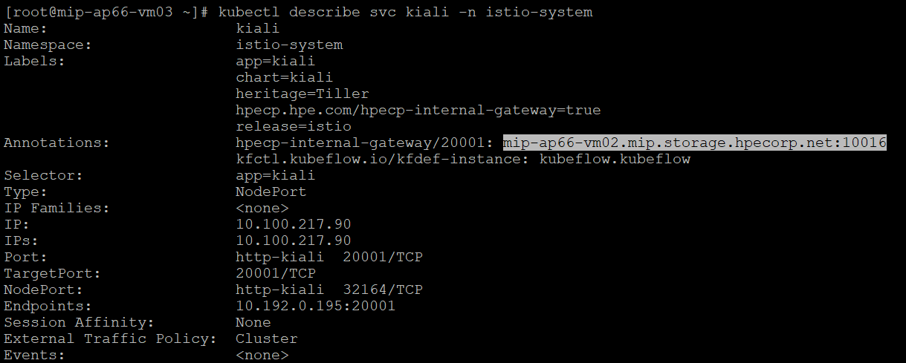
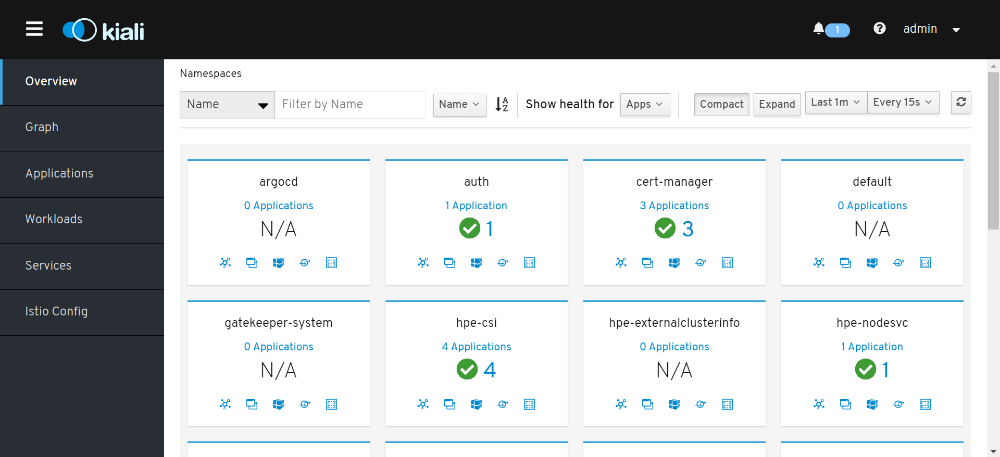

---
id: kiali-tutorial 
title: Istio Kiali
--- 

1. Describe kiali service to get the gateway port to access kiali UI: 

`$ kubectl describe svc kiali -n istio-system`

2. Access the UI with default username and password: admin/admin. 

