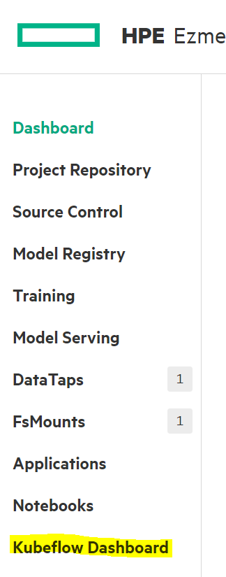
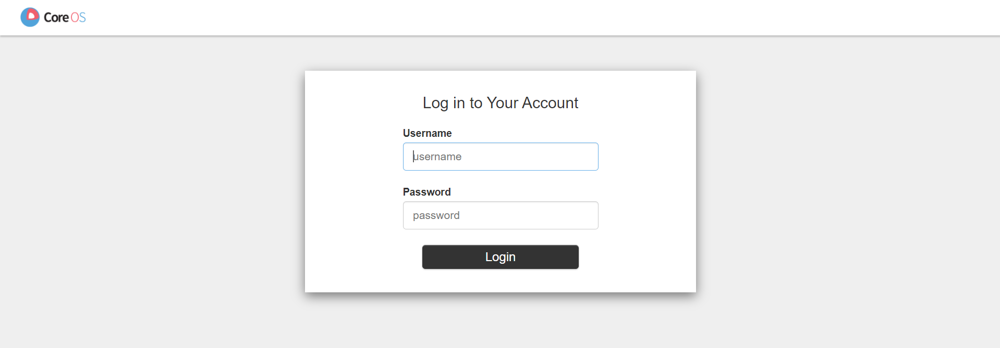
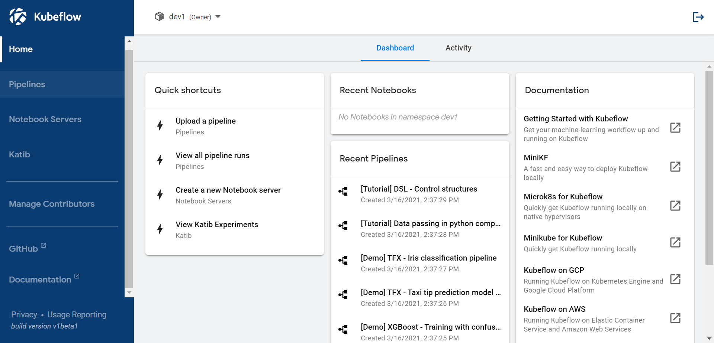
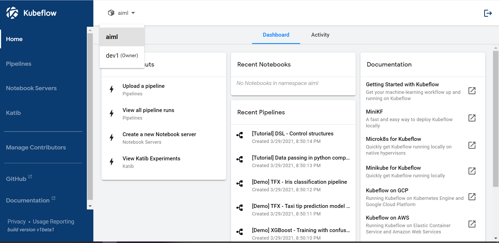

1. First login to Ezmeral Container Platform Control pane with your AD/LDAP credentials.

2. Then, click on Kubeflow Dashboard from the Left Navigation pane:

3. Kubeflow Dashboard login screen will appear in a new browser tab. Login with your AD/LDAP credentials.

4. It will prompt you to create a new profile namespace for you for the first time you login. Continue to get to the dashboard screen below. From here, you can open Kubeflow Notebook, run Experiments, pipelines etc.

5. You can switch to the tenant namespace by specifying tenant’s name in the namespace dropdown list: 

