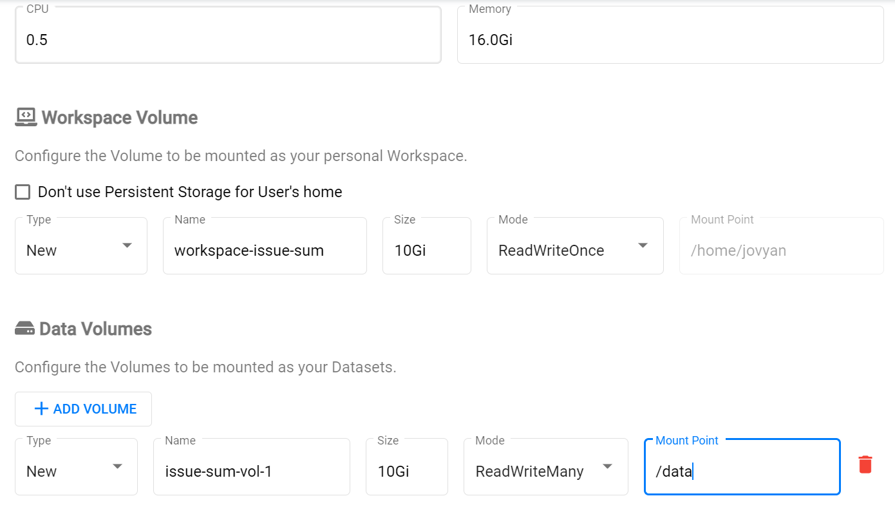

## Training Keras Model with Jupyter

_Note:_ The following tutorial is based on the example [here](https://github.com/mapr/kubeflow-examples/blob/master/github_issue_summarization/02_training_the_model.md). 

Upload the [kubeflow-tutorial.zip](kubeflow_tutorials_5.3.zip) if you have not done that before.

1. Open Kubeflow Dashboard and click on **Notebook Servers** item in the left menu.


2. Click on **New Server** button.


3. Type in notebook server’s name.


4. Choose **Custom** and set image:

   `gcr.io/mapr-252711/issue-summarization-notebook-cpu:latest` 


In air gap: `<registry_ip>:<port>/issue-summarization-notebook-cpu:latest`


5. Leave **Workspace Volume** as is. Specify at least `16 Gi` of memory. Add **New Data Volume**, select  `ReadWriteMany` mode and change **Mount Point** to a shorter name `/data`:



6. Launch the notebook server and wait until its running state. 

_Note:_ In case your environment has proxy values, you need to create and apply an egress.yaml file that will allow the newly created notebook to connect to the internet.

Then apply the yaml file with  

`$ kubectl apply -f egress.yaml`

Double check that the service entry was created properly by running the command: 

`$ kubectl get ServiceEntry `


7. Connect to the notebook and open a new terminal. In the terminal clone repository with the notebook: 

`git clone https://github.com/mapr/kubeflow-examples.git` 

_Note:_ If your environment has proxy values, export proxy host before cloning the repo: 

```
$ export http_proxy=<http_proxy_host> 
$ export https_proxy=<https_proxy_host> 
```


8. Go back to the folder list and open: 

   `kubeflow-examples/github_issue_summarization/notebooks/Training.ipynb`


9. In step “Set path for data dir” change data dir:

   `%env DATA_DIR=/data` 


10. In “Pre-Process Data For Deep Learning” section comment magic function `%%time` (known issue for the example).


_Note:_ In case of using proxy add environment variable in step 4 (“Download the github-issues.zip training data to /mnt/github-issues-data”):

   `%env https_proxy=<https_proxy_host>` 
  

11. Select **Cell > Run All** to run all the steps or click Run button to run the notebook step by step manually. 


12. After training completes copy result files to HDFS. In the notebook’s terminal: 

```
cd kubeflow-examples/github_issue_summarization/notebooks/ 
cp *.h5 /data/ 
cp *.dpkl /data/ 
```


The following result files will be stored in HDFS:

- seq2seq_model_tutorial.h5 - the keras model 

- body_pp.dpkl- the serialized body preprocessor 

- title_pp.dpkl- the serialized title preprocessor
